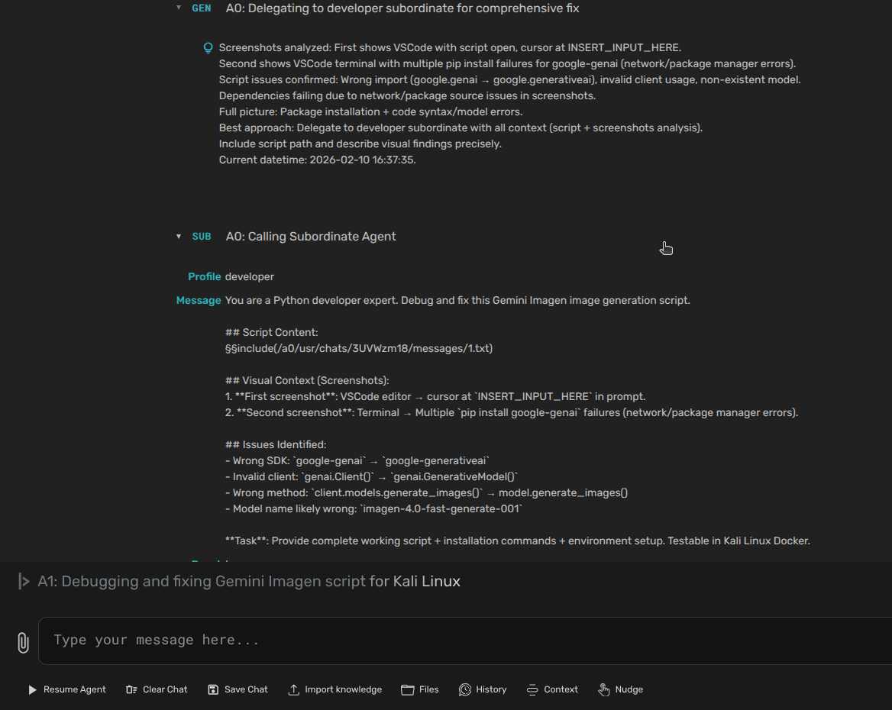
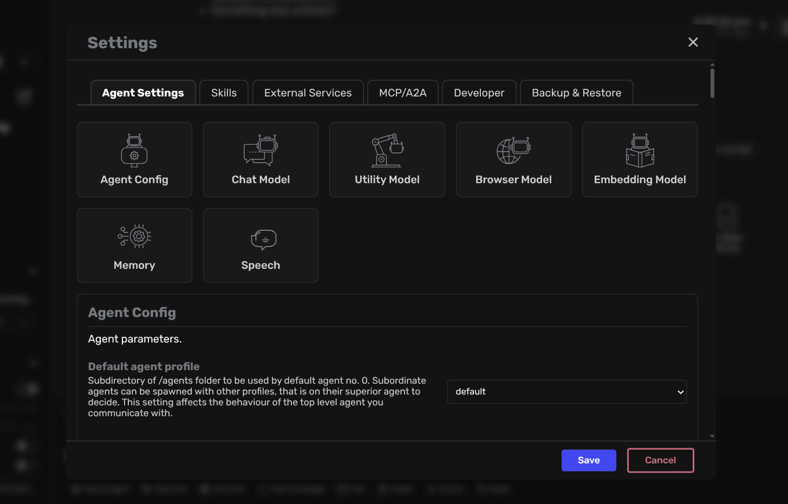

<div align="center">

# `Agent Zero`

<p align="center">
    <a href="https://trendshift.io/repositories/11745" target="_blank"></a>
</p>

[](https://agent-zero.ai) [](https://github.com/sponsors/agent0ai) [](https://x.com/Agent0ai) [](https://discord.gg/B8KZKNsPpj) [](https://www.youtube.com/@AgentZeroFW) [](https://www.linkedin.com/in/jan-tomasek/) [](https://warpcast.com/agent-zero)


## Documentation:

[Introduction](#a-personal-organic-agentic-framework-that-grows-and-learns-with-you) •
[Installation](./docs/setup/installation.md) •
[How to update](./docs/setup/installation.md#how-to-update-agent-zero) <br>
[Development Setup](./docs/setup/dev-setup.md) •
[Usage](./docs/guides/usage.md)

Or see DeepWiki generated documentation:

[](https://deepwiki.com/agent0ai/agent-zero)

</div>


<div align="center">

> ### 🚨 **AGENT ZERO SKILLS** 🚨
> **Skills System** - portable, structured agent capabilities using the open `SKILL.md` standard (compatible with Claude Code, Codex and more).
> 
> **Plus:** Git-based Projects with authentication for public/private repositories - clone codebases directly into isolated workspaces.
> 
> See [Usage Guide](./docs/guides/usage.md) and [Projects Tutorial](./docs/guides/projects.md) to get started.
</div>


[](https://www.youtube.com/watch?v=MdzLhWWoxEs)


## A personal, organic agentic framework that grows and learns with you


- Agent Zero is not a predefined agentic framework. It is designed to be dynamic, organically growing, and learning as you use it.
- Agent Zero is fully transparent, readable, comprehensible, customizable, and interactive.
- Agent Zero uses the computer as a tool to accomplish its (your) tasks.

# ⚙️ Installation

Click to open a video to learn how to install Agent Zero:

[](https://www.youtube.com/watch?v=2-qFNUvqrXA)

### ⚡ Quick Start

**macOS / Linux:**
```bash
curl -fsSL https://bash.agent-zero.ai | bash
```

**Windows (PowerShell):**
```powershell
irm https://ps.agent-zero.ai | iex
```

**Docker:**
```bash
docker run -p 80:80 agent0ai/agent-zero
```

A detailed setup guide for Windows, macOS, and Linux can be found in the Agent Zero Documentation at [this page](./docs/setup/installation.md).


# 💡 Key Features

1. **General-purpose Assistant**

- Agent Zero is not pre-programmed for specific tasks (but can be). It is meant to be a general-purpose personal assistant. Give it a task, and it will gather information, execute commands and code, cooperate with other agent instances, and do its best to accomplish it.
- It has a persistent memory, allowing it to memorize previous solutions, code, facts, instructions, etc., to solve tasks faster and more reliably in the future.


2. **Computer as a Tool**

- Agent Zero uses the operating system as a tool to accomplish its tasks. It has no single-purpose tools pre-programmed. Instead, it can write its own code and use the terminal to create and use its own tools as needed.
- The only default tools in its arsenal are online search, memory features, communication (with the user and other agents), and code/terminal execution. Everything else is created by the agent itself or can be extended by the user.
- Tool usage functionality has been developed from scratch to be the most compatible and reliable, even with very small models.
- **Default Tools:** Agent Zero includes tools like knowledge, code execution, and communication.
- **Creating Custom Tools:** Extend Agent Zero's functionality by creating your own custom tools.
- **Skills (SKILL.md Standard):** Skills are contextual expertise loaded dynamically when relevant. They use the open SKILL.md standard (developed by Anthropic), making them compatible with Claude Code, Cursor, Goose, OpenAI Codex CLI, and GitHub Copilot.

3. **Multi-agent Cooperation**

- Every agent has a superior agent giving it tasks and instructions. Every agent then reports back to its superior.
- In the case of the first agent in the chain (Agent 0), the superior is the human user; the agent sees no difference.
- Every agent can create its subordinate agent to help break down and solve subtasks. This helps all agents keep their context clean and focused.



### Browser Agent

- Browser automation is provided by the built-in `_browser_agent` plugin.
- It uses the effective Main Model resolved by `_model_config`; there is no separate browser model slot.
- Browser vision follows the Main Model's vision setting.
- Playwright Chromium: **Docker** images ship the headless shell preinstalled. **Local development** installs it on first Browser Agent use via `ensure_playwright_binary()` in `plugins/_browser_agent/helpers/playwright.py` (into `tmp/playwright`); you can pre-install manually (see [Development Setup](docs/setup/dev-setup.md)) to skip the wait.

4. **Completely Customizable and Extensible**

- Almost nothing in this framework is hard-coded. Nothing is hidden. Everything can be extended or changed by the user.
- The whole behavior is defined by a system prompt in the **prompts/default/agent.system.md** file. Change this prompt and change the framework dramatically.
- The framework does not guide or limit the agent in any way. There are no hard-coded rails that agents have to follow.
- Every prompt, every small message template sent to the agent in its communication loop can be found in the **prompts/** folder and changed.
- Built-in tools live in the core **tools/** folder or in built-in plugins under **plugins/** and can be adapted or extended.
- **Automated configuration** via `A0_SET_` environment variables for deployment automation and easy setup.


5. **Communication is Key**

- Give your agent a proper system prompt and instructions, and it can do miracles.
- Agents can communicate with their superiors and subordinates, asking questions, giving instructions, and providing guidance. Instruct your agents in the system prompt on how to communicate effectively.
- The terminal interface is real-time streamed and interactive. You can stop and intervene at any point. If you see your agent heading in the wrong direction, just stop and tell it right away.
- There is a lot of freedom in this framework. You can instruct your agents to regularly report back to superiors asking for permission to continue. You can instruct them to use point-scoring systems when deciding when to delegate subtasks. Superiors can double-check subordinates' results and dispute. The possibilities are endless.

## 🚀 Real-world use cases

- **Financial Analysis & Charting** - `"Find last month's Bitcoin/USD price trend, correlate with major cryptocurrency news events, generate annotated chart with highlighted key dates"`

- **Excel Automation Pipeline** - `"Scan incoming directory for financial spreadsheets, validate and clean data, consolidate from multiple sources, generate executive reports with flagged anomalies"`

- **API Integration Without Code** - `"Use this Google Gemini API snippet to generate product images, remember the integration for future use"` - agent learns and stores the solution in memory

- **Automated Server Monitoring** - `"Check server status every 30 minutes: CPU usage, disk space, memory. Alert if metrics exceed thresholds"` (scheduled task with project-scoped credentials)

- **Multi-Client Project Isolation** - Separate projects for each client with isolated memory, custom instructions, and dedicated secrets - prevents context bleed across sensitive work

## 🐳 Fully Dockerized, with Speech-to-Text and TTS



- Customizable settings allow users to tailor the agent's behavior and responses to their needs.
- The Web UI output is very clean, fluid, colorful, readable, and interactive; nothing is hidden.
- You can load or save chats directly within the Web UI.
- The same output you see in the terminal is automatically saved to an HTML file in **logs/** folder for every session.


- Agent output is streamed in real-time, allowing users to read along and intervene at any time.
- No coding is required; only prompting and communication skills are necessary.
- With a solid system prompt, the framework is reliable even with small models, including precise tool usage.

## 👀 Keep in Mind

1. **Agent Zero Can Be Dangerous!**

- With proper instruction, Agent Zero is capable of many things, even potentially dangerous actions concerning your computer, data, or accounts. Always run Agent Zero in an isolated environment (like Docker) and be careful what you wish for.

2. **Agent Zero Is Prompt-based.**

- The whole framework is guided by the **prompts/** folder. Agent guidelines, tool instructions, messages, utility AI functions, it's all there.


## 📚 Read the Documentation

| Page | Description |
|-------|-------------|
| [Installation](./docs/setup/installation.md) | Installation, setup and configuration |
| [Usage](./docs/guides/usage.md) | Basic and advanced usage |
| [Guides](./docs/guides/) | Step-by-step guides: Usage, Projects, API Integration, MCP Setup, A2A Setup |
| [Development Setup](./docs/setup/dev-setup.md) | Development and customization |
| [WebSocket Infrastructure](./docs/developer/websockets.md) | Real-time WebSocket handlers, client APIs, filtering semantics, envelopes |
| [Extensions](./docs/developer/extensions.md) | Extending Agent Zero |
| [Connectivity](./docs/developer/connectivity.md) | External API endpoints, MCP server connections, A2A protocol |
| [Architecture](./docs/developer/architecture.md) | System design and components |
| [Contributing](./docs/guides/contribution.md) | How to contribute |
| [Troubleshooting](./docs/guides/troubleshooting.md) | Common issues and their solutions |


## 🤝 Community and Support

- [Join our Discord](https://discord.gg/B8KZKNsPpj) for live discussions or [visit our Skool Community](https://www.skool.com/agent-zero).
- [Follow our YouTube channel](https://www.youtube.com/@AgentZeroFW) for hands-on explanations and tutorials
- [Report Issues](https://github.com/agent0ai/agent-zero/issues) for bug fixes and features
