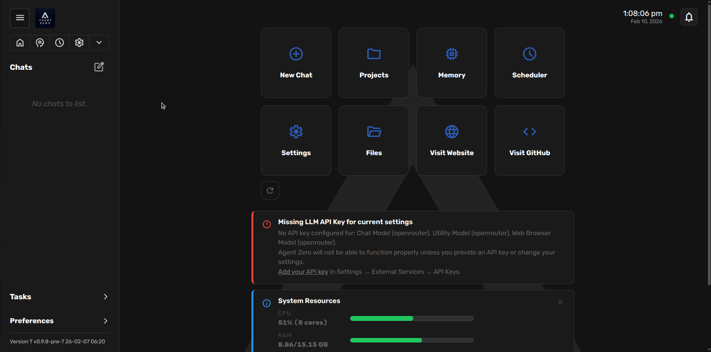
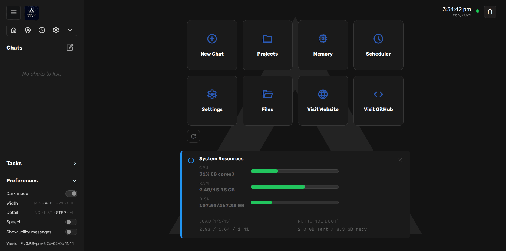
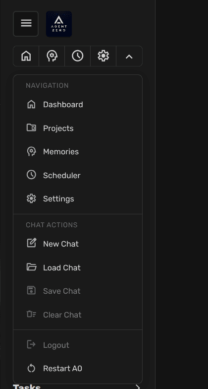
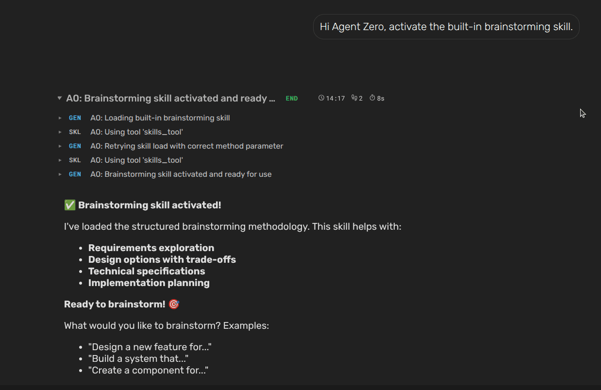

# Quick Start
This guide provides a quick introduction to using Agent Zero. We'll cover the recommended install path and running your first Skill.

## Installation (recommended)

Run one command; the script handles Docker, image pull, and container setup.

**macOS / Linux:**
```bash
curl -fsSL https://bash.agent-zero.ai | bash
```

**Windows (PowerShell):**
```powershell
irm https://ps.agent-zero.ai | iex
```

Follow the CLI prompts for port and authentication, complete onboarding, then open the Web UI URL from the terminal.

> [!TIP]
> To update later, open **Settings UI → Update tab → Open Self Update** (see [How to Update](setup/installation.md#how-to-update-agent-zero)). Backups are automatically managed internally.

> [!NOTE]
> For manual Docker Desktop setup, volume mapping, and platform-specific detail, see the [Installation Guide](setup/installation.md#manual-installation-advanced).

### Open the Web UI and configure your API key

Open your browser and navigate to `http://localhost:<PORT>`. The Web UI will show the onboarding banner. Click Start Onboarding to set your AI models and API key.



Click **Add your API key** to open Settings and configure:

- **Default Provider:** OpenRouter (supports most models with a single API key)
- **Alternative Providers:** Anthropic, OpenAI, Ollama/LM Studio (local models), and many others
- **Model Selection:** Choose your chat model (e.g., `anthropic/claude-sonnet-4-6` for OpenRouter)

> [!NOTE]
> Agent Zero supports any LLM provider, including local models via Ollama. For detailed provider configuration and local model setup, see the [Installation Guide](setup/installation.md#choosing-your-llms).

### Start your first chat

Once configured, you'll see the Agent Zero dashboard with access to:

- **Projects** - organize your work into projects
- **Memory** - open the memory dashboard
- **Scheduler** - create and manage planned tasks
- **Files** - open the File Browser
- **Settings** - configure models and preferences
- **System Stats** - monitor resource usage

Click **New Chat** to start creating with Agent Zero!



> [!TIP]
> The Web UI provides a comprehensive chat actions dropdown with options for managing conversations, including creating new chats, resetting, saving/loading, and many more advanced features. Chats are saved in JSON format in the `/usr/chats` directory.
>
> 

---

## Example Interaction
Let's ask Agent Zero to use one of the built-in skills. Here's how:

1. Type "Activate your brainstorming skill" in the chat input field and press Enter or click the send button.
2. Agent Zero will process your request. You'll see its thoughts and tool calls in the UI.
3. The agent will acknowledge the skill activation and ask you for a follow-up on the brainstorming request.

Here's an example of what you might see in the Web UI at step 3:



## Next Steps
Now that you've run a simple task, you can experiment with more complex requests. Try asking Agent Zero to:

* Connect to your email
* Execute shell commands
* Develop skills
* Explore web development tasks
* Develop A0 itself

### [Open A0 Usage Guide](guides/usage.md)

Provides more in-depth information on tools, projects, tasks, and backup/restore.

## 🎓 Video Tutorials
- [MCP Server Setup](https://youtu.be/pM5f4Vz3_IQ)
- [Projects & Workspaces](https://youtu.be/RrTDp_v9V1c)
- [Memory Management](https://youtu.be/sizjAq2-d9s)
